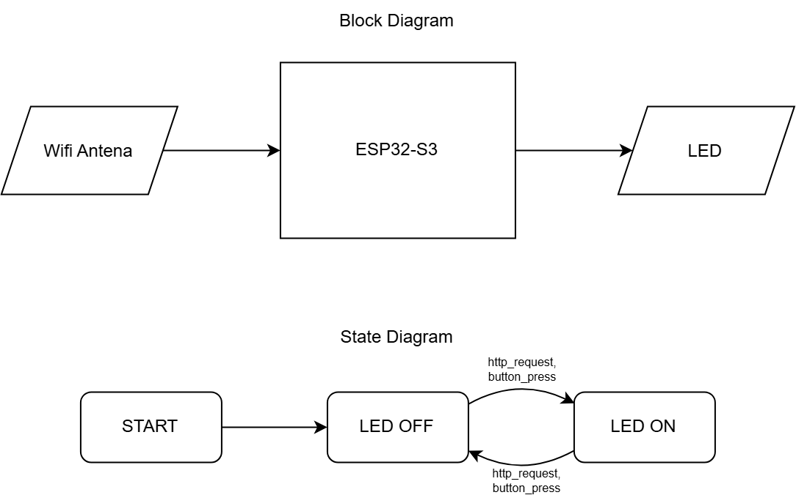

# Architecture



Two inputs, one output, and a state machine with exactly two states. The block half of that diagram omits the button as an input — worth correcting next time the source is edited.

```
src/
  components/
    led/                    external LED + on-board WS2812, driven as one output
    button/                 interrupt-driven, debounced push button
    wifi/
      network_manager/      joins the network, reports link state
      web_server/           HTTP control surface on port 80
  main.cpp                  wiring only
```

## The dependency rule

**A component never reaches into a sibling component.** `main.cpp` is the only file that knows about more than one.

That rule has one deliberate exception: `web_server` includes `network_manager`, because both live inside the `wifi/` group and the coupling is internal to that group. What the rule protects against is `wifi/` depending on `components/led`, which would weld the HTTP layer to this particular output.

So `web_server` never includes `led.h`. It is handed what it may do:

```cpp
struct LedControl {
  void (*on)();
  void (*off)();
  void (*toggle)();
  bool (*isOn)();
  uint32_t (*toggles)();
};
```

and `main.cpp` supplies the real functions:

```cpp
webServerBegin({ledOn, ledOff, ledToggle, ledIsOn, ledToggleCount});
```

Two things fall out of this. The server can drive a relay or a motor without being edited, and its endpoints can be tested on a development machine against a fake `LedControl` with no board attached.

Module internals are private — each `.cpp` keeps its state in an anonymous namespace. Nothing outside `led.cpp` can write the LED state; it goes through `ledToggle()`. Nothing outside `button.cpp` can see the interrupt counter.

## Control flow

`setup()` initialises the two hardware components, joins the network, and starts the server only if the join succeeded. A failed join is not fatal — the button keeps working.

`loop()` does two things and must never block:

```cpp
uint32_t presses = buttonTakePresses();
for (uint32_t i = 0; i < presses; i++) ledToggle();

if (networkIsUp()) webServerPoll();
```

`webServerPoll()` is what actually services HTTP. The server is synchronous, so a request sits unanswered until that call runs. Any `delay()` in `loop()` becomes HTTP latency directly.

## Concurrency

Two inputs reach the same LED state, and they do not arrive the same way.

The **button is an interrupt**. Its handler is marked `IRAM_ATTR` so it lives in RAM — an interrupt can fire while the SPI flash bus is busy, and an ISR that has to be fetched from an unavailable bus crashes the chip. The handler does no real work: `neopixelWrite()` and `Serial` are both unsafe in interrupt context, so it debounces, increments a counter, and returns.

The **HTTP handlers run in `loop()` context**, because `webServerPoll()` is called from there. They are therefore not racing each other, and `ledToggle()` needs no lock.

What does race is the press counter, shared between the ISR and `loop()`. `volatile` alone is not enough — it prevents the compiler caching the value, but a read-modify-write can still be interrupted halfway. Both sides use a spinlock:

```cpp
portENTER_CRITICAL(&mux);
count = pendingPresses;
pendingPresses = 0;      // read and clear must be indivisible
portEXIT_CRITICAL(&mux);
```

Splitting that read and clear into two statements loses any press arriving in between. On ESP32 the spinlock also guards against the other core, which matters because the WiFi stack genuinely runs on core 0 while `loop()` runs on core 1.

A counter rather than a flag, because two presses arriving before `loop()` services them must produce two toggles. See [TC-3.3](process.md#test-plan) for the measurement that confirms nothing is dropped.
