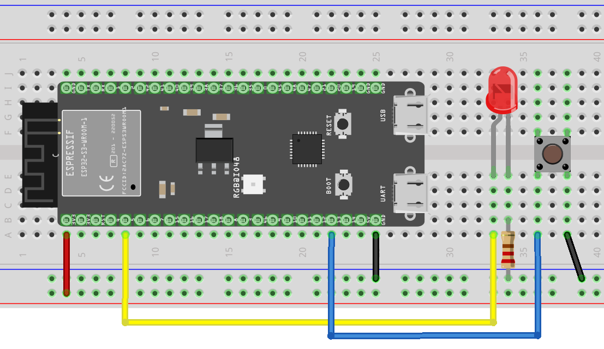

# Hardware

Hosyond ESP32-S3 dev board — an ESP32-S3-DevKitC-1 clone with two USB-C ports, carrying an **ESP32-S3-WROOM-1-N16R8** module: 16 MB quad SPI flash, 8 MB octal SPI PSRAM. Breadboard, USB powered.

## Pin map

| Pin | Direction | Connected to |
| --- | --- | --- |
| GPIO4 | output | External LED, through a 220 Ω series resistor |
| GPIO13 | input | Push button to ground, using the internal pull-up |
| GPIO48 | output | On-board WS2812 RGB LED |



Schematic: [schematic-v2.png](img/schematic-v2.png). Fritzing sources are in [img/fritzing](img/fritzing).

These carry a `v2` suffix because that iteration produced them, and they are still current — v3.0 added WiFi, which changed no wiring. Earlier diagrams are in [deprecated/img](deprecated/img).

**GPIO35, GPIO36 and GPIO37 are unavailable.** The `R8` suffix means octal PSRAM, and the PSRAM interface consumes those three pins. The pins above are unaffected, but any expansion has to route around them.

## The on-board LED is not a plain LED

GPIO48 drives a **WS2812**, which takes a timed one-wire bitstream rather than a voltage level. `digitalWrite(48, HIGH)` does nothing. Use the Arduino core's built-in driver:

```cpp
neopixelWrite(48, red, green, blue);   // values 0-255 per channel
```

No external library is needed — `esp32-hal-rgb-led` ships with the core, and the ESP32-S3 variant header already defines `PIN_NEOPIXEL` as 48.

Some clones ship with the RGB LED's solder jumper open. If GPIO48 does nothing at all, inspect the pad next to the LED before assuming a software fault.

## Serial goes out the UART port, not the native USB port

The two USB-C connectors are not interchangeable:

| Connector | Chip | Enumerates as | Carries `Serial` when |
| --- | --- | --- | --- |
| UART | CH343 bridge | VID `1A86` | `ARDUINO_USB_CDC_ON_BOOT=0` |
| Native USB | the ESP32-S3 itself | VID `303A` | `ARDUINO_USB_CDC_ON_BOOT=1` |

This project sets `ARDUINO_USB_CDC_ON_BOOT=0`, so **plug into the UART connector**. The build also pins `monitor_port` / `upload_port`, which is machine-specific — delete those lines and let PlatformIO auto-detect if you are working on your own board.

The UART route is the more forgiving one: its port persists across resets and uploads, whereas the native USB port re-enumerates every time the chip restarts and drops your monitor with it.

## Flash and PSRAM configuration

The board definition defaults to 8 MB flash and no PSRAM, which does not match an N16R8 module. The overrides in `platformio.ini` correct that — and one of them has a trap worth knowing about:

```ini
board_build.arduino.memory_type = qio_opi
board_build.partitions = default_16MB.csv
board_upload.flash_size = 16MB
board_upload.maximum_size = 16777216
```

Flash size **must** be set through `board_upload.*`. Setting `board_build.flash_size` instead is silently ignored, leaving 8 MB in the bootloader image header. A 16 MB partition table against an 8 MB header makes the second-stage bootloader reject the table and reset — the board then boot-loops roughly 34 times a second, before printing a single line, so the serial monitor stays blank and gives you nothing to work with.

Confirm the settings took by checking the boot banner: flash should report 16 MB and PSRAM a non-zero size.
