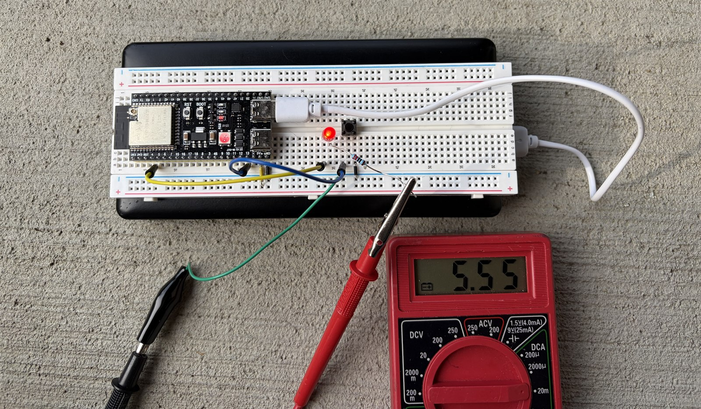

# Process

The project was built as a V-Model exercise: every iteration runs requirements → design → implementation → test, and each requirement is traced to the code that satisfies it and the test that proves it.

Three iterations, each adding an input:

| Iteration | Input added |
| --- | --- |
| v1.0 | Timer |
| v2.0 | Push button |
| v3.0 | HTTP request over WiFi |

Tagged in git as `v1.0`, `v2.0`, `v3.0`. The original specification is kept in [deprecated/original-spec.pdf](deprecated/original-spec.pdf); this page supersedes it.

## Requirements

| ID | Requirement | Status |
| --- | --- | --- |
| REQ-1 | The LED shall blink automatically at a 200 ms interval when idle | Superseded at v2.0 |
| REQ-2 | The external LED shall be driven within GPIO limits (12 mA recommended, 40 mA maximum) | Met, measured |
| REQ-3 | A button press shall toggle the LED | Met |
| REQ-4 | The LED shall be toggleable by button press **or** HTTP request | Met |

REQ-1 was deliberately retired at v2.0: the timer was superseded by the button as the LED's control source, so the idle blink was removed rather than left running underneath the button.

## Traceability

| Requirement | Module | Test cases |
| --- | --- | --- |
| REQ-1 | *(retired — was `loop()`)* | TC-1.1 |
| REQ-2 | `components/led` | TC-1.2, TC-1.3 |
| REQ-3 | `components/button` | TC-2.1, TC-2.2, TC-2.3 |
| REQ-4 | `components/button`, `components/wifi/web_server` | TC-3.1, TC-3.2, TC-3.3 |

## Test plan

| ID | Level | What it checks | Status |
| --- | --- | --- | --- |
| TC-1.1 | Unit | LED turns on, turns off, and toggles | Automated — `pio test -e target` |
| TC-1.2 | Integration | Measured current draw on GPIO4 is within spec | Manual — 5.55 mA, see below |
| TC-1.3 | System | Stable across 50+ power cycles | Manual |
| TC-2.1 | Unit | Debounce reports one clean press, no false triggers | Automated — `pio test -e native` and `-e target` |
| TC-2.2 | Integration | A physical press toggles the real LED | Manual |
| TC-2.3 | System | Repeated inputs produce repeated outputs | Manual |
| TC-3.1 | Unit | HTTP endpoints are valid and return the expected payloads | Automated — `pio test -e native` and `system_test.py` |
| TC-3.2 | Integration | HTTP requests reach the LED functions | Automated — `system_test.py` |
| TC-3.3 | System | No request is dropped when both inputs contend | Automated — `system_test.py --serial` |

See [testing.md](testing.md) for how to run each tier. Current totals: 14 host tests, 9 on-target tests, 21 system checks.

TC-2.2, TC-2.3 and the contention half of TC-3.3 need a finger on the button, so they cannot be run fully unattended. The harness does the counting, a human supplies the presses.

## Manual Test Results

### TC-1.2 result

Multimeter in series with GPIO4, LED on: **5.55 mA**.



| | |
| --- | --- |
| Measured | 5.55 mA |
| Recommended ceiling | 12 mA — using 46% of it |
| Absolute maximum | 40 mA — using 14% of it |

The measurement validates the design. With a 220 Ω series resistor from a 3.3 V rail, 5.55 mA implies a forward voltage of 3.3 − (0.00555 × 220) = **2.08 V**, which is an ordinary red LED.

### TC-1.3 result

50+ power cycles, counted by hand. The board came up correctly every time: network joined, dashboard served, button responsive.

No harness and no log, so this document is the only record. Worth re-running by hand after any change to startup behaviour, since nothing in CI will catch a regression here.

### TC-2.2 result

A physical press toggles the real LED on the breadboard. Observed continuously through development, and most rigorously as part of the TC-3.3 run below: **77 presses, each one logged on serial and each incrementing the toggle counter**.

### TC-2.3 result

Repeated inputs produce repeated outputs, with no collapsing and no double-fires.

From the same run: **77 presses over 20 seconds — roughly 3.8 per second — all counted**. Interestingly, the rate matters here. It is fast enough that a flag-based implementation would have merged presses arriving in the same service interval. The spinlock guards the counter against this.

Separately, an idle board with the interrupt attached produced **zero** phantom presses across a 10-second window.

### TC-3.3 result

Both inputs driven simultaneously for 20 seconds — 200 HTTP toggles fired from a host script while the button was pressed by hand:

```
HTTP toggles accepted:    200
button presses on serial:  77
expected total:           277
actual toggle delta:      277
```

The board's `toggles` counter, exposed on `/status`, is what makes this arithmetic rather than a judgement call. Nothing was dropped under contention.
